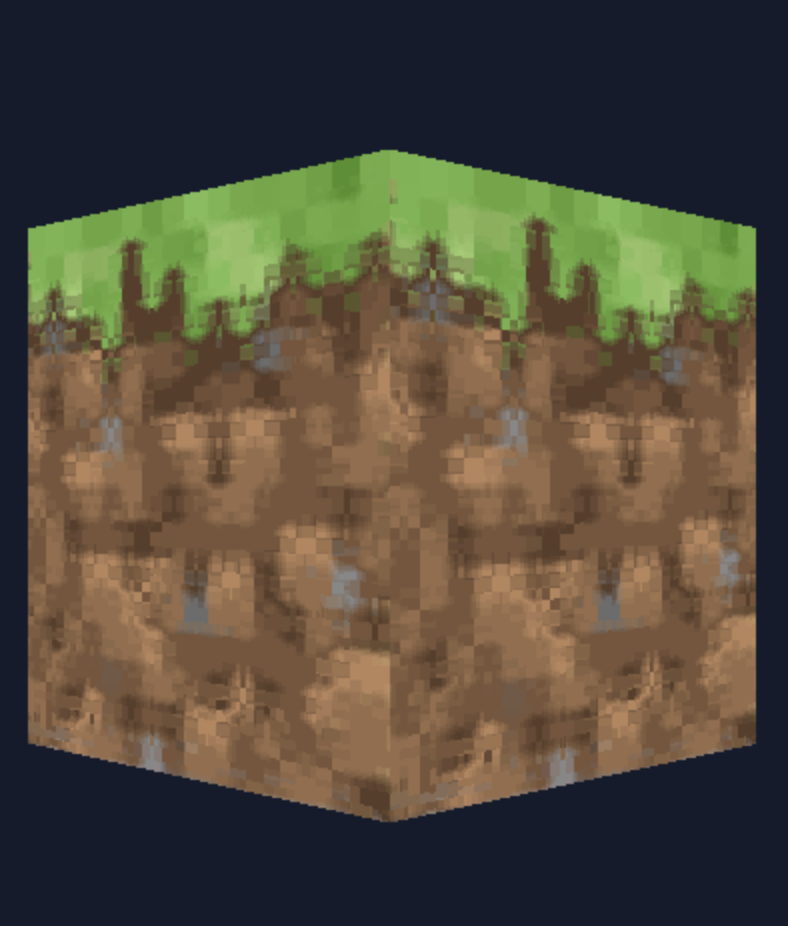
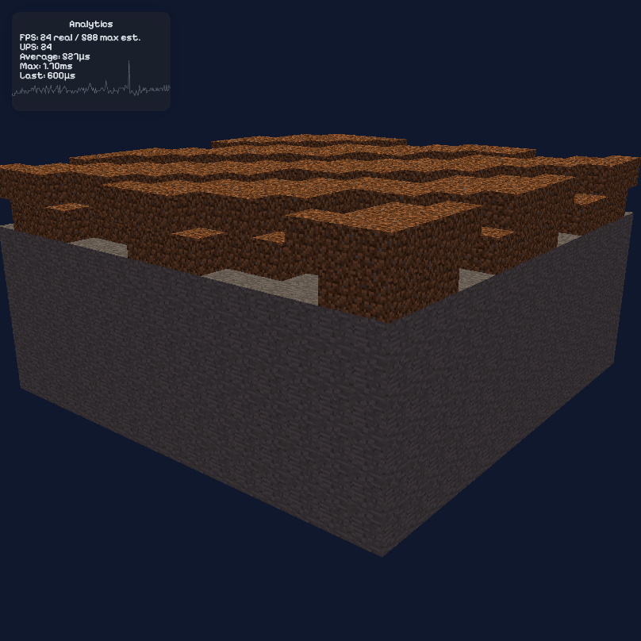
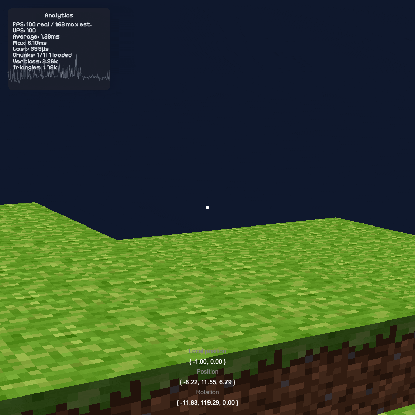
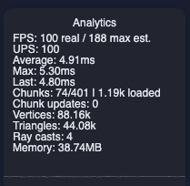
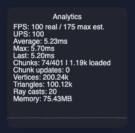

# Mine

WebGL minecraft-like concept.

<!-- 

    

		
        
    

 -->

	<a href="https://leandrosq.github.io/js-mine/">Live demo here [Soon]</a>

## Devlog

### Day 0

After playing a little bit with `WebGL 2.0` this is what I came up with:

	

Some really cool looking cube,  where each face is being colored by their normal.

I think I spent more time coming up with the `GIF` above than actually coding the renderer. Since I wanted something nice and `screen recording` + `gif conversion` + `free online editors` were not cutting it... so I decided to save the frames, zip them, download and run `ffmpeg` to convert them to a gif.

Not long after that I introduced textures and a simple lighting system:

	

Now we talking

### Day 1

Did not have much time today, so mainly cleaned up the code, added wrappers for `WebGL` boilerplate which made life easier and also played with some post-processing effects.

Added `FXAA`, but it either introduces too much blur on the textures or does not work at all, not sure if this is apparent on the `GIF` below.

	

<small>Some FXAA artifacts</small>

Added some `sharpen`, `brightness`, `contrast` and `saturation`, which works great.

	

Original on the <b>left</b> and new on the <b>right</b>. <small>GIF above is compressed, colors may not be the same</small>

But mostly important, the rendering pipeline now supports frame buffers and drawing to textures with multi-pass filtering, all done with my wrappers which makes me happy.

### Day 2

The boilerplate is gone!
Spent the day refactoring the code, which makes creating meshes, shaders and buffers a breeze.
Also, why not, I moved the recording logic to a worker, first time I used an `OffscreenCanvas`... they are really powerful. Maybe I will use it for the rendering pipeline in the future, imagine the possibilities — rendering everything in a worker, no hiccups on the main thread.

	

<small>Some smooth <s>not really</s> camera controls</small> *This GIF is heavily compressed

Also, since the mesh system is organized, creating a bunch of cubes is easy, I'm not using instanced rendering yet, and to be honest I won't, since the goal of the project is to generate a single mesh for the world, and not a mesh for each block. Nevertheless, this helps to visualize the goal.

### Day 3

Actually didn't do much on the rendering side, I really wanted to work on my Gamepad support I carried over from other projects.
And now that the gamepad support was refined... I also thought it would be a nice addition having a virtual Gamepad overlay

	

<small>Took more time than I'd like to admit, but it looks so sick</small>

Just so I can say I did something on the renderer, I created a `MeshBuilder`, the goal with this is to create geometry on the fly, so instead of rendering N cubes, I generate a single mesh with all the faces that are touching Air, which means the faces inside will be culled, and the faces outside will be rendered. **This is what makes this whole thing possible, without this optimization, the performance would be terrible.**

	

<small>Note to self: I need to add a counter for triangles, vertices and draw calls That would be a nice debugging info to have.</small>

### Day 4

A few things I added:
- **Chunk system**: I'm now rendering only the chunks that are visible, this is a huge performance boost, since I'm not rendering the whole world, only the parts that are visible.
- **Frustum culling**: I'm now only rendering the chunks that are inside the camera frustum, this was such a pain to implement, but it was worth it.
- **Terrain generation**: Using `simplex-noise.js`, I'm generating biomes and terrain, yet to be refined, but it's a start.
- **3D Gizmo system**: I'm now able to visualize objects when debugging, this is a huge help when working with `frustum culling`.
- **Ansiotropic filtering**: I'm now using `ansio filtering` for the textures, this makes the textures look better when viewed from a distance.
- **Multi camera support**: I'm now able to render to multiple cameras, I'm using this for debugging, I call it `the debug camera`.
- **Triangle, active chunks and vertices counter**: I was right, looks nice.
- **Rendering pipeline**: Automatically handling all my post-processing filters with double buffering, this is a huge help when adding new filters.

With all that, I can get a scene with 1024 chunks active (200~ rendered) at 100+fps on my M1 Macbook, which is pretty good. To show case all these features, instead of a thousand GIFs, I made a video:

 

	

<small>Click on the image to see the video.</small>

### Day 5

You also won't believe this, but I have made the terrain generation to be `M-U-L-T-I-T-H-R-E-A-D-E-D`, yes, you heard it right, I'm generating the terrain in a `worker`, this is a huge performance boost, since I'm not blocking the main thread with the generation of the terrain. Such a pain to handle the communication back-and-forth between the `worker` and the main thread, but it was worth it.

Another thing I implemented was a nice `debug console`, that just evaluates whatever JS code I input in it, this is a huge help when debugging, since I can test settings on the fly.

	

<small>Pretty fancy, right?</small>

### Day 6

Since we now have terrain generation happening on the background I have split the process into two steps:
- **Generate the terrain**: This is done in a worker, generating the terrain and sending it back to the main thread.
- **Build the mesh**: This is done by the same worker, but using the main thread to orchestrate the process, since a chunk with updated meshing data will require its neighbors to be updated as well.

    

		
        
    

<small>On the left with occluding faces hidden / right showing all faces neighboring chunks</small>

A 44% improvement on the amount of vertices/triangles being drawn! That's almost half of the mesh data that we don't have to send anymore to the GPU. A huge performance boost.

## Used in this project

| Name | Description |
| -- | -- |
| Eslint | For linting and semantic analysis |
| Prettier | For code formatting |
| Browser sync | For live reloading |
| Esbuild | For bundling |
| gulp | For task automation |
| SASS | For CSS preprocessing |
| Github actions | For CI, building and deploying to github pages |
| Google fonts | For the [Pixelify Sans font](https://fonts.google.com/specimen/Pixelify+Sans) |
| [Real favicon generator](https://realfavicongenerator.net/) | For generating the favicon |
| [gl-matrix](http://glmatrix.net/) | For matrix operations, this library is awesome |
| [zipjs](https://gildas-lormeau.github.io/zip.js/) | For zip file manipulation ~duh~ |
| [filesaver.js](https://github.com/eligrey/FileSaver.js) | For saving files ~duh~ |
| [thebennybox](https://www.youtube.com/watch?v=Z9bYzpwVINA) | On the bright explanation of FXAA |
| [gifski](https://github.com/ImageOptim/gifski) | For converting frames to gif like a champ |
| [ffmpeg](https://ffmpeg.org/) | For converting video to gif like a champ |
| [simplex-noise.js](https://github.com/jwagner/simplex-noise.js) | For generating noise |
